# 🏦 Proyecto BankApp - Backend

## 📋 Tabla de Contenidos

- [🏦 Proyecto BankApp - Backend](#-proyecto-bankapp---backend)
  - [📋 Tabla de Contenidos](#-tabla-de-contenidos)
  - [📝 Descripción General](#-descripción-general)
  - [🏗️ Arquitectura](#️-arquitectura)
  - [🎥 Videos Demostrativos](#-videos-demostrativos)
  - [📊 Diagramas de Clases por Proyecto](#-diagramas-de-clases-por-proyecto)
  - [🔧 Prerrequisitos Globales](#-prerrequisitos-globales)
  - [⚙️ Configuración Inicial del Proyecto](#️-configuración-inicial-del-proyecto)
  - [🚀 Ejecución del Sistema Localmente](#-ejecución-del-sistema-localmente)
  - [🗄️ Configuración de Bases de Datos](#️-configuración-de-bases-de-datos)
  - [🔐 Configuración de Auth0](#-configuración-de-auth0)
  - [📡 Endpoints Principales del API Gateway](#-endpoints-principales-del-api-gateway)
  - [🤝 Contribuciones](#-contribuciones)
  - [📄 Licencia](#-licencia)

## 📝 Descripción General

Este proyecto implementa el backend para una aplicación bancaria simplificada 🏧, construida con una arquitectura de microservicios. Incluye un API Gateway encargado de la autenticación (Auth0) 🔐, autorización, y enrutamiento de solicitudes a los servicios subyacentes.

La arquitectura cuenta con servicios implementados en Node.js 🟢 (con MongoDB) como primarios, y servicios equivalentes en Java/Spring Boot ☕ (con PostgreSQL) que actúan como fallback para asegurar la resiliencia del sistema.

Los servicios principales son:
* **💰 Servicio de Consulta de Saldo**
* **📈 Servicio de Depósitos**
* **💸 Servicio de Retiros**

## 🏗️ Arquitectura

```mermaid
graph TD
    %% Styles
    classDef actor fill:#D6EAF8,stroke:#3498DB,stroke-width:2px,color:#000;
    classDef gateway fill:#FADBD8,stroke:#E74C3C,stroke-width:2px,color:#000;
    classDef nodeSvc fill:#D5F5E3,stroke:#2ECC71,stroke-width:2px,color:#000;
    classDef javaSvc fill:#FCF3CF,stroke:#F1C40F,stroke-width:2px,color:#000;
    classDef database fill:#EBDEF0,stroke:#8E44AD,stroke-width:2px,color:#000;
    classDef authSvc fill:#E8DAEF,stroke:#9B59B6,stroke-width:2px,color:#000;

    %% Actors and External Services
    UC["Cliente (Frontend/App Móvil)"]:::actor
    AUTH0["Auth0 (Autenticación)"]:::authSvc

    %% API Gateway and its User Provisioning Databases
    subgraph "Capa del API Gateway"
        APIGW["API Gateway (Node.js/Express)"]:::gateway
        PG_Users_GW["PostgreSQL (Usuarios Gateway - bankapp.users)"]:::database
        Mongo_Users_GW["MongoDB (Usuarios Gateway - Opcional/Legado)"]:::database
    end

    %% Node.js Microservices (Primarios)
    subgraph "Microservicios Primarios (Node.js + MongoDB)"
        direction LR
        NodeBalance["Servicio Balance (Node.js)"]:::nodeSvc
        NodeDeposit["Servicio Depósito (Node.js)"]:::nodeSvc
        NodeWithdraw["Servicio Retiro (Node.js)"]:::nodeSvc

        MongoDB_NodeBalance["MongoDB (Datos Balance Node)"]:::database
        MongoDB_NodeDeposit["MongoDB (Datos Depósito Node)"]:::database
        MongoDB_NodeWithdraw["MongoDB (Datos Retiro Node)"]:::database
    end

    %% Java/Spring Boot Microservices (Fallback)
    subgraph "Microservicios de Fallback (Java/Spring Boot + PostgreSQL)"
        direction LR
        JavaBalance["Servicio Balance (Java)"]:::javaSvc
        JavaDeposit["Servicio Depósito (Java)"]:::javaSvc
        JavaWithdraw["Servicio Retiro (Java)"]:::javaSvc

        PostgreSQL_Java_Services["PostgreSQL (bankapp_db - Común para Servicios Java)"]:::database
    end

    %% Flujo de Autenticación
    UC -- "1. Inicia Sesión" --> AUTH0
    AUTH0 -- "2. Emite Token JWT" --> UC

    %% Flujo de Solicitud Principal
    UC -- "3. Solicitud API con Token JWT" --> APIGW

    APIGW -- "4. Valida Token JWT con Auth0" --> AUTH0

    %% User Provisioning en API Gateway
    APIGW -- "5a. Obtiene pgId por auth0_id" --> PG_Users_GW
    APIGW -- "5b. (Opcional) Obtiene mongoId por auth0_id" --> Mongo_Users_GW

    %% Flujo de API Gateway a Servicios Primarios (Node.js)
    APIGW -- "6a. Intento Primario (Balance) [X-User-ID: mongoId]" --> NodeBalance
    NodeBalance -- "Accede Datos" --> MongoDB_NodeBalance

    APIGW -- "6b. Intento Primario (Depósito) [X-User-ID: mongoId]" --> NodeDeposit
    NodeDeposit -- "Accede Datos" --> MongoDB_NodeDeposit

    APIGW -- "6c. Intento Primario (Retiro) [X-User-ID: mongoId]" --> NodeWithdraw
    NodeWithdraw -- "Accede Datos" --> MongoDB_NodeWithdraw

    %% Flujo de Fallback del API Gateway a Servicios Java
    NodeBalance -.->|Falla?| APIGW
    NodeDeposit -.->|Falla?| APIGW
    NodeWithdraw -.->|Falla?| APIGW

    APIGW -- "7a. Fallback (Balance) [X-User-ID: pgId]" --> JavaBalance
    JavaBalance -- "Accede Datos" --> PostgreSQL_Java_Services

    APIGW -- "7b. Fallback (Depósito) [X-User-ID: pgId]" --> JavaDeposit
    JavaDeposit -- "Accede Datos" --> PostgreSQL_Java_Services

    APIGW -- "7c. Fallback (Retiro) [X-User-ID: pgId]" --> JavaWithdraw
    JavaWithdraw -- "Accede Datos" --> PostgreSQL_Java_Services

    %% Respuestas
    NodeBalance -- "Respuesta" --> APIGW
    NodeDeposit -- "Respuesta" --> APIGW
    NodeWithdraw -- "Respuesta" --> APIGW

    JavaBalance -- "Respuesta (si se usó fallback)" --> APIGW
    JavaDeposit -- "Respuesta (si se usó fallback)" --> APIGW
    JavaWithdraw -- "Respuesta (si se usó fallback)" --> APIGW

    APIGW -- "Respuesta Final" --> UC
```



**🔧 Componentes Principales:**
1. **🌐 API Gateway (Node.js/Express):** Punto único de entrada. Maneja autenticación (Auth0), aprovisionamiento de información de usuario (conectándose a PostgreSQL y/o MongoDB), inyección de headers (`X-User-ID`), y enrutamiento con lógica de fallback a servicios Java.
2. **🟢 Microservicios Node.js (Express + MongoDB):** Implementaciones primarias para las operaciones de balance, depósito y retiro.
3. **☕ Microservicios Java (Spring Boot + PostgreSQL):** Implementaciones de fallback para las operaciones de balance, depósito y retiro, utilizando una base de datos relacional.

## 🎥 Videos Demostrativos

### 📱 Demo de la Aplicación
[](https://youtu.be/TPzTOHvRGuM)

### 📈 Casos de Uso
[](https://youtu.be/ITfjRoJVzyw)

## 📊 Diagramas de Clases por Proyecto

### 🏗️ Diagrama de Clases General
[](https://youtu.be/wQaTLKRFTcg)

### 📋 Estructura de Clases por Servicio

#### 🟢 Servicios Node.js
- **Balance Service**: Manejo de consultas de saldo
- **Deposit Service**: Procesamiento de depósitos
- **Withdrawal Service**: Gestión de retiros

#### ☕ Servicios Java
- **Balance Service**: Servicio de fallback para consultas de saldo
- **Deposit Service**: Servicio de fallback para depósitos
- **Withdrawal Service**: Servicio de fallback para retiros

## 🔧 Prerrequisitos Globales

Antes de comenzar, asegúrate de tener instalado lo siguiente:

* **🟢 Node.js:** v18.x o superior (incluye npm)
* **📦 Yarn (opcional):** Si prefieres yarn sobre npm
* **☕ Java JDK:** v17 o superior (OpenJDK o similar)
* **🔨 Maven o Gradle:** Según cómo estén construidos tus proyectos Java
* **🍃 MongoDB:** Una instancia local o en la nube (ej. MongoDB Atlas)
* **🐘 PostgreSQL:** Una instancia local o en la nube (ej. ElephantSQL, AWS RDS)
* **🔐 Auth0:** Una cuenta y una aplicación API configurada
* **📝 Git:** Para clonar el repositorio
* **💻 IDE/Editor de Código:** De tu preferencia (VS Code, IntelliJ IDEA, etc.)
* **🧪 Cliente API:** Como Postman o Insomnia para probar los endpoints

## ⚙️ Configuración Inicial del Proyecto

1. **📥 Clonar el Repositorio:**
    ```bash
    git clone <URL_DEL_REPOSITORIO>
    cd <NOMBRE_DEL_DIRECTORIO_DEL_PROYECTO>
    ```

2. **🔧 Variables de Entorno:**
    Cada servicio (API Gateway y los microservicios individuales) utiliza archivos `.env` para su configuración. Deberás crear un archivo `.env` en la raíz de cada servicio a partir de los archivos `.env.example`.

## 🚀 Ejecución del Sistema Localmente

Es recomendable iniciar los componentes en el siguiente orden:
1. 🗄️ Bases de Datos (MongoDB, PostgreSQL)
2. 🔧 Microservicios de Backend (Node.js y Java)
3. 🌐 API Gateway

---

### 1. 🌐 API Gateway (Node.js)

* **📁 Directorio:** `/api-gateway`
* **📋 Descripción:** Maneja la autenticación, el aprovisionamiento de ID de usuario y el enrutamiento con fallback

* **🔧 Variables de Entorno (`api-gateway/.env`):**
    ```dotenv
    # Configuración General del API Gateway
    NODE_ENV=development
    PORT=3000

    # Configuración de Auth0
    AUTH0_DOMAIN=tu-dominio.us.auth0.com
    AUTH0_AUDIENCE=tu-api-audience

    # Conexión a PostgreSQL
    PG_HOST=localhost
    PG_PORT=5432
    PG_USER=tu_usuario_pg
    PG_PASSWORD=tu_password_pg
    PG_DATABASE=tu_bd_pg
    PG_SCHEMA=bankapp

    # Conexión a MongoDB
    MONGO_URI=mongodb+srv://<usuario>:<password>@<cluster>/<basedatos>?retryWrites=true&w=majority&appName=APIGatewayMongo

    # URLs de Microservicios Node.js (Primarios)
    NODE_BALANCE_SERVICE_URL=http://localhost:3001
    NODE_DEPOSIT_SERVICE_URL=http://localhost:3002
    NODE_WITHDRAWAL_SERVICE_URL=http://localhost:3003

    # URLs de Microservicios Java/Spring Boot (Fallback)
    JAVA_BALANCE_SERVICE_URL=http://localhost:8080
    JAVA_DEPOSIT_SERVICE_URL=http://localhost:8081
    JAVA_WITHDRAWAL_SERVICE_URL=http://localhost:8082
    ```

* **📦 Instalación:**
    ```bash
    cd api-gateway
    npm install
    ```

* **▶️ Ejecución:**
    ```bash
    npm start
    ```
    El API Gateway estará disponible en `http://localhost:3000` 🌐

* **📚 Documentación API (Swagger):**
    Disponible en `http://localhost:3000/api-docs`

---

### 2. 🟢 Microservicios Node.js (MongoDB)

#### a. 💰 Servicio de Balance (Node.js)

* **📁 Directorio:** `/node-balance-service`
* **📋 Descripción:** Proporciona el endpoint para consultar el saldo de la cuenta

* **🔧 Variables de Entorno (`node-balance-service/.env`):**
    ```dotenv
    NODE_ENV=development
    PORT=3001
    MONGO_URI=mongodb+srv://<usuario>:<password>@<cluster>/<basedatos_cuentas>?retryWrites=true&w=majority&appName=NodeBalanceService
    ```

* **📦 Instalación:**
    ```bash
    cd node-balance-service
    npm install
    ```

* **▶️ Ejecución:**
    ```bash
    npm start
    ```

#### b. 📈 Servicio de Depósito (Node.js)

* **📁 Directorio:** `/node-deposit-service`
* **📋 Descripción:** Proporciona el endpoint para realizar depósitos

* **🔧 Variables de Entorno (`node-deposit-service/.env`):**
    ```dotenv
    NODE_ENV=development
    PORT=3002
    MONGO_URI=mongodb+srv://<usuario>:<password>@<cluster>/<basedatos_cuentas_o_transacciones>?retryWrites=true&w=majority&appName=NodeDepositService
    ```

#### c. 💸 Servicio de Retiro (Node.js)

* **📁 Directorio:** `/node-withdrawal-service`
* **📋 Descripción:** Proporciona el endpoint para realizar retiros

* **🔧 Variables de Entorno (`node-withdrawal-service/.env`):**
    ```dotenv
    NODE_ENV=development
    PORT=3003
    MONGO_URI=mongodb+srv://<usuario>:<password>@<cluster>/<basedatos_cuentas_o_transacciones>?retryWrites=true&w=majority&appName=NodeWithdrawalService
    ```

---

### 3. ☕ Microservicios Java/Spring Boot (PostgreSQL)

#### a. 💰 Servicio de Balance (Java)

* **📁 Directorio:** `/java-balance-service`
* **📋 Descripción:** Proporciona el endpoint de fallback para consultar saldo

* **🔧 Configuración (`application.properties`):**
    ```properties
    server.port=8080
    spring.application.name=balance-service

    # Configuración de DataSource para PostgreSQL
    spring.datasource.url=jdbc:postgresql://localhost:5432/bankapp_db?currentSchema=bankapp
    spring.datasource.username=tu_usuario_pg
    spring.datasource.password=tu_password_pg
    spring.datasource.driver-class-name=org.postgresql.Driver

    # Configuración de JPA/Hibernate
    spring.jpa.hibernate.ddl-auto=update
    spring.jpa.show-sql=true
    spring.jpa.properties.hibernate.dialect=org.hibernate.dialect.PostgreSQLDialect
    spring.jpa.properties.hibernate.format_sql=true

    # Configuración de Springdoc OpenAPI (Swagger UI)
    springdoc.api-docs.path=/api-docs/balance
    springdoc.swagger-ui.path=/swagger-ui-balance.html
    ```

* **🔨 Construcción (Maven):**
    ```bash
    cd java-balance-service
    mvn clean install
    ```

* **▶️ Ejecución:**
    ```bash
    java -jar target/balance-service-0.0.1-SNAPSHOT.jar
    # o mvn spring-boot:run
    ```

#### b. 📈 Servicio de Depósito (Java)

* **📁 Directorio:** `/java-deposit-service`
* **🔧 Configuración:** Similar al servicio de balance, con `server.port=8081`

#### c. 💸 Servicio de Retiro (Java)

* **📁 Directorio:** `/java-withdrawal-service`
* **🔧 Configuración:** Similar al servicio de balance, con `server.port=8082`

---

## 🗄️ Configuración de Bases de Datos

### 🍃 MongoDB
* Asegúrate de que tu instancia de MongoDB esté corriendo y accesible
* El API Gateway y los servicios Node.js se conectarán usando la `MONGO_URI` proporcionada
* Las colecciones serán creadas automáticamente por Mongoose

### 🐘 PostgreSQL
* Asegúrate de que tu instancia de PostgreSQL esté corriendo y accesible
* Crea la base de datos y ejecuta el siguiente script SQL:

```sql
-- Creación de la base de datos
CREATE DATABASE bankapp_db;

-- Conéctate a bankapp_db y ejecuta:
CREATE SCHEMA bankapp;

-- Función para actualizar updated_at automáticamente
CREATE OR REPLACE FUNCTION bankapp.update_updated_at_column()
RETURNS TRIGGER AS $$
BEGIN
   NEW.updated_at = NOW();
   RETURN NEW;
END;
$$ LANGUAGE 'plpgsql';

-- Tabla de usuarios
CREATE TABLE bankapp.users (
    id                                  BIGSERIAL PRIMARY KEY,
    auth0_id                            VARCHAR(255) NOT NULL UNIQUE,
    first_name                          VARCHAR(100) NOT NULL,
    last_name                           VARCHAR(100) NOT NULL,
    email                               VARCHAR(255) NOT NULL UNIQUE,
    email_verified                      BOOLEAN DEFAULT FALSE,
    phone_country_code                  VARCHAR(10),
    phone_number                        VARCHAR(50),
    phone_is_verified                   BOOLEAN DEFAULT FALSE,
    address_street                      VARCHAR(255),
    address_apartment_or_unit           VARCHAR(100),
    address_city                        VARCHAR(100),
    address_state_or_department         VARCHAR(100),
    address_zip_code                    VARCHAR(20),
    address_country                     VARCHAR(5) DEFAULT 'CO',
    date_of_birth                       DATE,
    nationality                         VARCHAR(100),
    identification_document_type        VARCHAR(20),
    identification_document_number      VARCHAR(50),
    identification_document_issue_date  DATE,
    identification_document_expiry_date DATE,
    status                              VARCHAR(50) DEFAULT 'pending_verification' NOT NULL,
    agreed_to_terms_version             VARCHAR(50),
    preferences_language                VARCHAR(10) DEFAULT 'es',
    preferences_notifications_email     BOOLEAN DEFAULT TRUE,
    preferences_notifications_sms       BOOLEAN DEFAULT FALSE,
    preferences_notifications_push      BOOLEAN DEFAULT TRUE,
    last_login_at                       TIMESTAMPTZ,
    created_at                          TIMESTAMPTZ DEFAULT CURRENT_TIMESTAMP NOT NULL,
    updated_at                          TIMESTAMPTZ DEFAULT CURRENT_TIMESTAMP NOT NULL,
    CONSTRAINT check_user_status CHECK (status IN ('active', 'inactive', 'pending_verification', 'suspended'))
);

-- Trigger para actualizar updated_at
CREATE TRIGGER trigger_update_users_updated_at
    BEFORE UPDATE ON bankapp.users
    FOR EACH ROW
    EXECUTE FUNCTION bankapp.update_updated_at_column();

-- Tabla de roles
CREATE TABLE bankapp.roles (
    id SERIAL PRIMARY KEY,
    name VARCHAR(50) NOT NULL UNIQUE,
    description TEXT,
    created_at TIMESTAMPTZ NOT NULL DEFAULT CURRENT_TIMESTAMP,
    updated_at TIMESTAMPTZ NOT NULL DEFAULT CURRENT_TIMESTAMP
);

CREATE TRIGGER trigger_update_roles_updated_at
    BEFORE UPDATE ON bankapp.roles
    FOR EACH ROW
    EXECUTE FUNCTION bankapp.update_updated_at_column();

-- Tabla de unión user_roles
CREATE TABLE bankapp.user_roles (
    user_id BIGINT NOT NULL,
    role_id INTEGER NOT NULL,
    assigned_at TIMESTAMPTZ NOT NULL DEFAULT CURRENT_TIMESTAMP,
    PRIMARY KEY (user_id, role_id),
    CONSTRAINT fk_user_roles_user
        FOREIGN KEY(user_id)
        REFERENCES bankapp.users(id)
        ON DELETE CASCADE,
    CONSTRAINT fk_user_roles_role
        FOREIGN KEY(role_id)
        REFERENCES bankapp.roles(id)
        ON DELETE CASCADE
);

-- Tabla de cuentas
CREATE TABLE bankapp.accounts (
    id BIGSERIAL PRIMARY KEY,
    user_id BIGINT NOT NULL,
    account_number VARCHAR(20) NOT NULL UNIQUE,
    account_type VARCHAR(50) NOT NULL,
    balance NUMERIC(19, 4) NOT NULL DEFAULT 0.00,
    currency VARCHAR(3) NOT NULL DEFAULT 'COP',
    status VARCHAR(50) NOT NULL DEFAULT 'pending_activation',
    overdraft_limit NUMERIC(19, 4) NOT NULL DEFAULT 0.00,
    interest_rate NUMERIC(5, 4) DEFAULT 0.0000,
    created_at TIMESTAMPTZ NOT NULL DEFAULT CURRENT_TIMESTAMP,
    updated_at TIMESTAMPTZ NOT NULL DEFAULT CURRENT_TIMESTAMP,

    CONSTRAINT fk_accounts_user
        FOREIGN KEY(user_id)
        REFERENCES bankapp.users(id)
        ON DELETE CASCADE,
    CONSTRAINT check_account_type
        CHECK (account_type IN ('savings', 'checking', 'loan', 'credit')),
    CONSTRAINT check_account_status
        CHECK (status IN ('active', 'inactive', 'closed', 'suspended', 'pending_activation')),
    CONSTRAINT check_currency_code
        CHECK (currency ~ '^[A-Z]{3}$')
);

CREATE TRIGGER trigger_update_accounts_updated_at
    BEFORE UPDATE ON bankapp.accounts
    FOR EACH ROW
    EXECUTE FUNCTION bankapp.update_updated_at_column();

-- Datos iniciales
INSERT INTO bankapp.roles (name, description) VALUES
('customer', 'Cliente estándar de la aplicación bancaria.'),
('admin', 'Administrador del sistema con todos los privilegios.')
ON CONFLICT (name) DO NOTHING;
```

---

## 🔐 Configuración de Auth0

1. Ve a tu dashboard de Auth0 🏠
2. **🔧 Crea una API:**
   * Dale un Nombre (ej. "BankApp API Gateway")
   * Establece un Identificador (Audience), ej. `https://api.bankapp.com`
   * Deja el algoritmo de firma como RS256
3. **🌐 Obtén el Dominio:** El dominio de tu tenant de Auth0 debe ir en `AUTH0_DOMAIN`

---

## 📡 Endpoints Principales del API Gateway

Todas las solicitudes deben incluir un token JWT válido en el header `Authorization: Bearer <token>` 🔑

### 💰 Consulta de Saldo
```
GET /api/balance
```

### 📈 Realizar Depósito
```
POST /api/deposit
Content-Type: application/json

{
  "amount": 100.50
}
```

### 💸 Realizar Retiro
```
POST /api/withdraw
Content-Type: application/json

{
  "amount": 50.25
}
```

**📚 Documentación completa:** Consulta la documentación Swagger del API Gateway en `/api-docs` para más detalles y para probar los endpoints.

---

## 🤝 Contribuciones

¡Las contribuciones son bienvenidas! 🎉 Si deseas contribuir al proyecto:

1. 🍴 Fork el repositorio
2. 🌿 Crea una rama para tu feature (`git checkout -b feature/AmazingFeature`)
3. 💾 Commit tus cambios (`git commit -m 'Add some AmazingFeature'`)
4. 📤 Push a la rama (`git push origin feature/AmazingFeature`)
5. 🔃 Abre un Pull Request

---

## 📄 Licencia

Este proyecto está licenciado bajo la Licencia MIT - ver el archivo [LICENSE](LICENSE) para más detalles.

```
MIT License

Copyright (c) 2024 BankApp

Permission is hereby granted, free of charge, to any person obtaining a copy
of this software and associated documentation files (the "Software"), to deal
in the Software without restriction, including without limitation the rights
to use, copy, modify, merge, publish, distribute, sublicense, and/or sell
copies of the Software, and to permit persons to whom the Software is
furnished to do so, subject to the following conditions:

The above copyright notice and this permission notice shall be included in all
copies or substantial portions of the Software.

THE SOFTWARE IS PROVIDED "AS IS", WITHOUT WARRANTY OF ANY KIND, EXPRESS OR
IMPLIED, INCLUDING BUT NOT LIMITED TO THE WARRANTIES OF MERCHANTABILITY,
FITNESS FOR A PARTICULAR PURPOSE AND NONINFRINGEMENT. IN NO EVENT SHALL THE
AUTHORS OR COPYRIGHT HOLDERS BE LIABLE FOR ANY CLAIM, DAMAGES OR OTHER
LIABILITY, WHETHER IN AN ACTION OF CONTRACT, TORT OR OTHERWISE, ARISING FROM,
OUT OF OR IN CONNECTION WITH THE SOFTWARE OR THE USE OR OTHER DEALINGS IN THE
SOFTWARE.
```